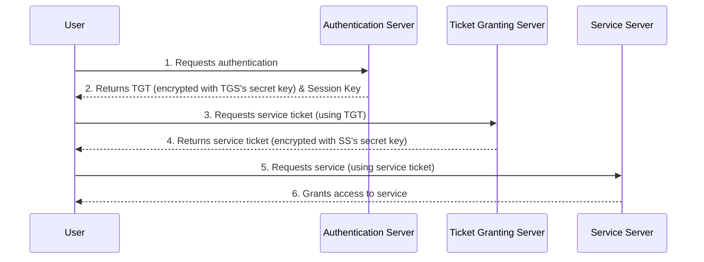
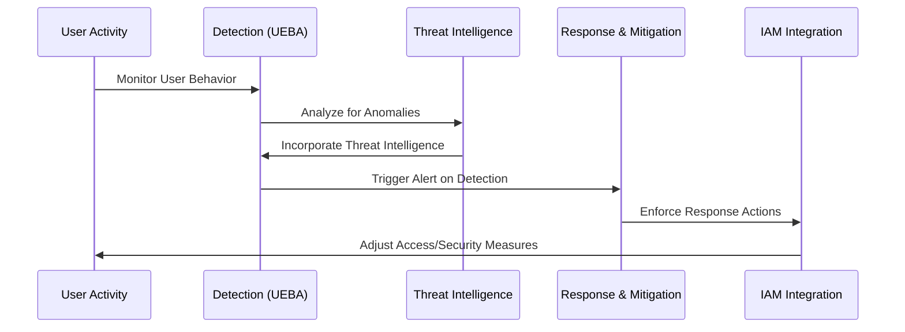
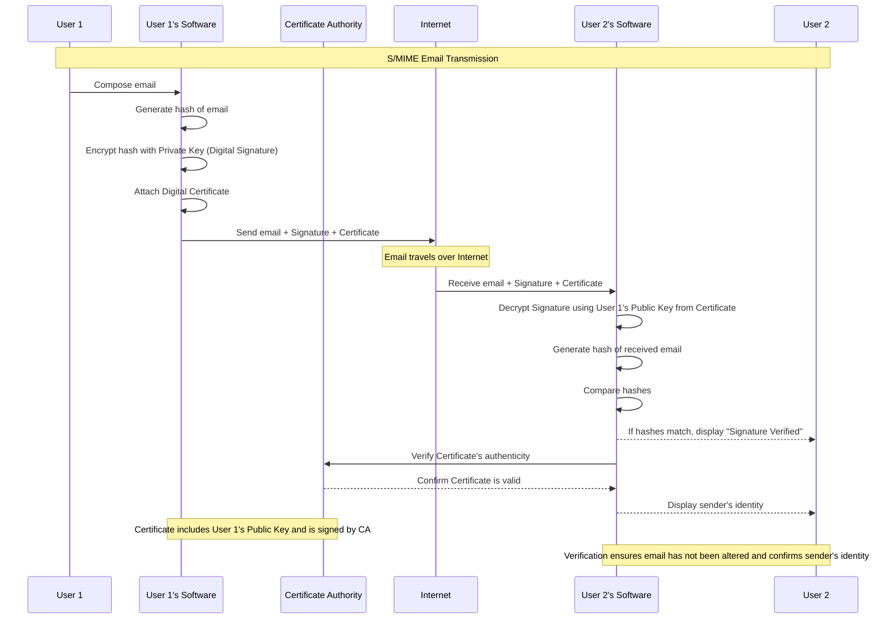
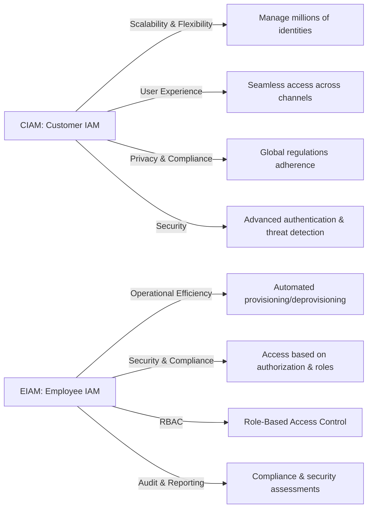
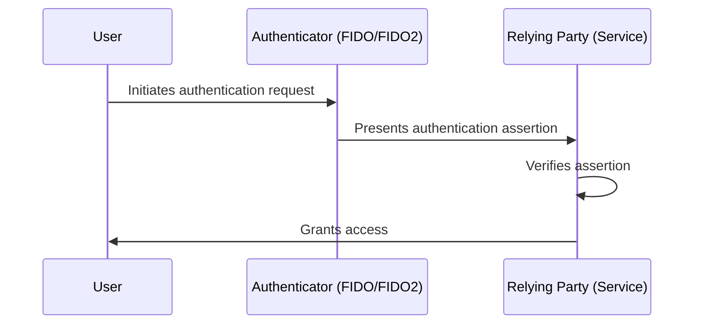
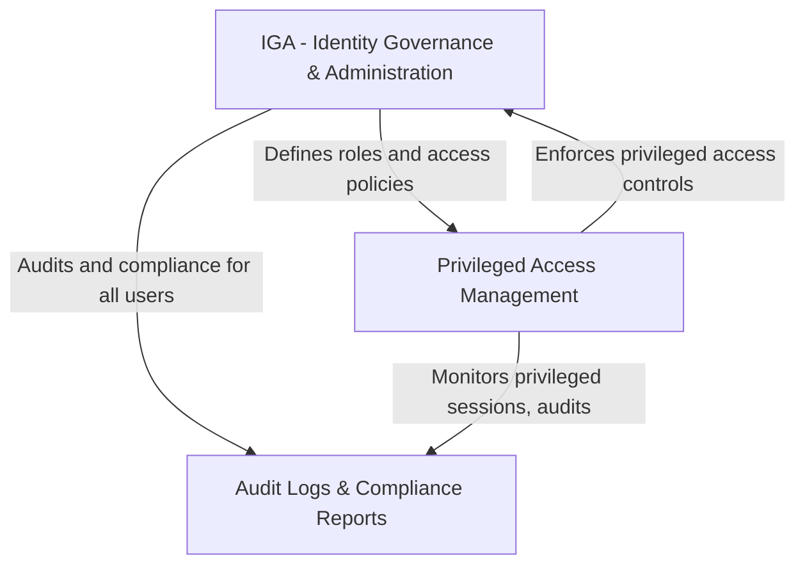
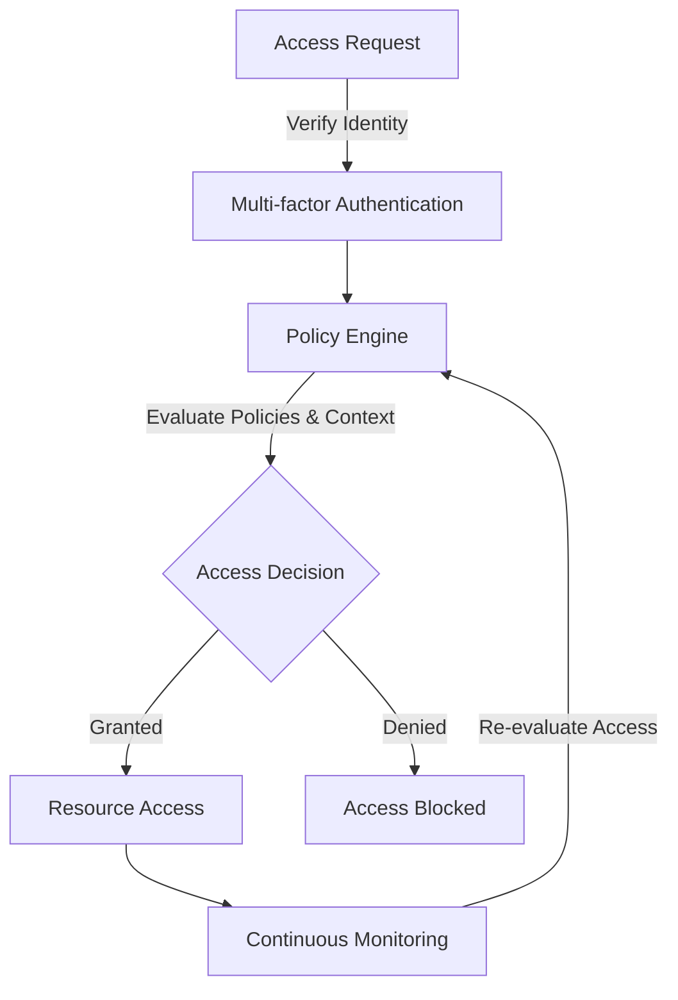

| **Threat**                     | **Mitigation Resource**                                      | **Example/Notes**                                            |
| ------------------------------ | ------------------------------------------------------------ | ------------------------------------------------------------ |
| **RAT (Remote Access Trojan)** | Endpoint Detection and Response (EDR) solutions with behavioral analysis capabilities. | E.g., SentinelOne, which detects and responds to RATs by analyzing behavior rather than relying solely on known signatures. |
| **BotNets**                    | Advanced Threat Protection (ATP) services that include network behavior analysis and botnet detection. | E.g., Palo Alto Networks' ATP service, which uses machine learning and AI to identify and block botnet-related activities. |
| **Worms**                      | Unified Threat Management (UTM) systems that combine firewall, antivirus, and intrusion prevention. | E.g., Fortinet FortiGate, offering comprehensive protection against worms and other malware. |
| **Ransomware**                 | Backup solutions that offer air-gapped, immutable, or otherwise secure backup copies. | E.g., Rubrik, providing secure backups that can't be encrypted by ransomware. |
| **DDoS**                       | DDoS mitigation services that can absorb and mitigate high-volume attacks. | E.g., Akamai Prolexic, specializing in protecting against large-scale DDoS attacks. |

| Services Offered                       | Description                                                  |
| -------------------------------------- | ------------------------------------------------------------ |
| Disaster Recovery as a Service (DRaaS) | Ensures rapid recovery of IT systems, applications, and data after a disaster using cloud technologies. |
| Backup as a Service (BUaaS)            | Provides secure, cloud-based data backup solutions to minimize data loss. |
| Cyber Resilience Service               | Bolsters defenses against cyber attacks to prevent, detect, and respond to threats. |
| IT Resilience Orchestration (ITRO)     | Offers automated disaster recovery solutions for quick and efficient restoration of IT environments. |
| Consulting and Planning                | Helps organizations develop and refine their business continuity plans for comprehensive protection. |

| Phase                        | Duration  | Description                                                  |
| ---------------------------- | --------- | ------------------------------------------------------------ |
| Assessment and Planning      | 1-2 weeks | Initial consultations to understand needs, identify critical systems and data, and plan strategies. |
| Solution Design and Setup    | 4-6 weeks | Design disaster recovery and continuity solutions, including cloud backup and cybersecurity measures. |
| Migration and Implementation | 6-8 weeks | Migrate data, set up replication for servers and endpoints, and configure disaster recovery. |
| Training and Optimization    | 2-4 weeks | Train IT staff and optimize solutions based on performance and recovery tests. |

| **Cyberthreat**                | **Mitigation Resource**                                      | **Example/Notes**                                            |
| ------------------------------ | ------------------------------------------------------------ | ------------------------------------------------------------ |
| **Remote Access Trojan (RAT)** | Security awareness training, strict access control, secure remote access solutions, and implementing least privilege. | Imperva highlights the importance of vigilance against RATs due to their stealthy nature and ability to give attackers administrative control over a victim's computer. Tools like Imperva's Web Application Firewall can prevent such attacks by monitoring and blocking malicious traffic. |
| **BotNets**                    | Intrusion Detection Systems (IDS) like Snort, and Mail Assure for email security. | Snort is used industry-wide for its packet sniffing functions and anomaly- and signature-based policies that can flag several potential security threats, including those related to botnets. Mail Assure provides advanced threat protection for inbound and outbound emails, reducing the risk of malware attacks delivered via email. |
| **Worms**                      | Use of comprehensive antivirus solutions and regular patching of systems. | Antivirus solutions can detect and remove worms. Regular system updates and patches close vulnerabilities that worms might exploit to spread. |
| **Ransomware**                 | Backup solutions and advanced threat protection systems.     | Regular backups ensure data can be restored without paying ransoms. Advanced threat protection systems can detect and block ransomware before it encrypts files. |
| **DDoS**                       | DDoS protection services like Cloudflare or Akamai.          | These services can absorb and mitigate large-scale DDoS attacks, preventing them from overwhelming your network. |

| Feature Category                           | CIAM (Customer IAM)                                          | EIAM (Employee IAM)                                          |
| ------------------------------------------ | ------------------------------------------------------------ | ------------------------------------------------------------ |
| **Objectives**                             |                                                              |                                                              |
| Scalability and Flexibility                | Manage millions of identities, supporting spikes in traffic and diverse customer behaviors. | Automate access provisioning and deprovisioning to reduce IT overhead and enhance productivity. |
| Enhanced User Experience                   | Provide seamless, secure access across various digital channels to improve customer satisfaction and retention. | N/A                                                          |
| Privacy and Regulatory Compliance          | Ensure compliance with global data protection regulations like GDPR, CCPA by managing user consents and data securely. | Secure sensitive corporate data by ensuring that only authorized employees have access, aligned with compliance requirements. |
| Security                                   | Protect customer identities from fraud and breaches, employing advanced authentication and threat detection mechanisms. | Assign access rights based on employee roles, minimizing the risk of internal and external breaches. |
| **Key Features**                           |                                                              |                                                              |
| Social Login and Self-Service Registration | Simplify the signup and login process.                       | N/A                                                          |
| Multi-Factor Authentication (MFA)          | Enhance security without compromising user convenience.      | N/A (But applicable in a broader sense for securing employee access) |
| Unified Customer View                      | Aggregate customer data across different platforms for better service and personalization. | N/A                                                          |
| Consent Management                         | Give users control over their data and comply with privacy laws. | N/A                                                          |
| Automated Provisioning                     | N/A                                                          | Streamline onboarding and offboarding processes.             |
| Single Sign-On (SSO)                       | N/A (But commonly used in CIAM for user convenience)         | Simplify access to multiple applications with one set of credentials. |
| Privileged Access Management (PAM)         | N/A                                                          | Monitor and control access to critical systems and data.     |
| Access Reviews                             | N/A                                                          | Regularly review and adjust access rights to ensure they are up to date. |

| Feature/Aspect           | IGA                                                     | PAM                                                          |
| ------------------------ | ------------------------------------------------------- | ------------------------------------------------------------ |
| **Primary Focus**        | Governance and administration of all digital identities | Management and security of privileged accounts               |
| **Objectives**           | Visibility, control, compliance, automated provisioning | Securing privileged accounts, monitoring, session management |
| **Key Features**         | Access certification, role and policy management        | Credential vaulting, session isolation and monitoring, least privilege enforcement |
| **Compliance and Audit** | Central to IGA objectives                               | Essential, with a focus on privileged account activities     |
| **Automation**           | Covers a broad range of identity management processes   | Focuses on privileged account and access processes           |
| **User Scope**           | All users within the organization                       | Users with elevated access rights (e.g., admins, executives) |

| Feature             | Traditional IAM                                | Zero Trust IAM                                               |
| ------------------- | ---------------------------------------------- | ------------------------------------------------------------ |
| Trust Model         | Trusts users within the network by default     | Does not trust anyone by default; verifies every request     |
| Access Control      | Broad access based on user roles               | Granular access based on least privilege and context         |
| Verification Method | Often relies on single-factor authentication   | Requires multi-factor authentication and continuous verification |
| Network Security    | Focuses on securing the perimeter              | Focuses on securing internal and external access points      |
| Response to Threats | Reactive; responds after breaches are detected | Proactive; continuously monitors and adjusts access controls |
