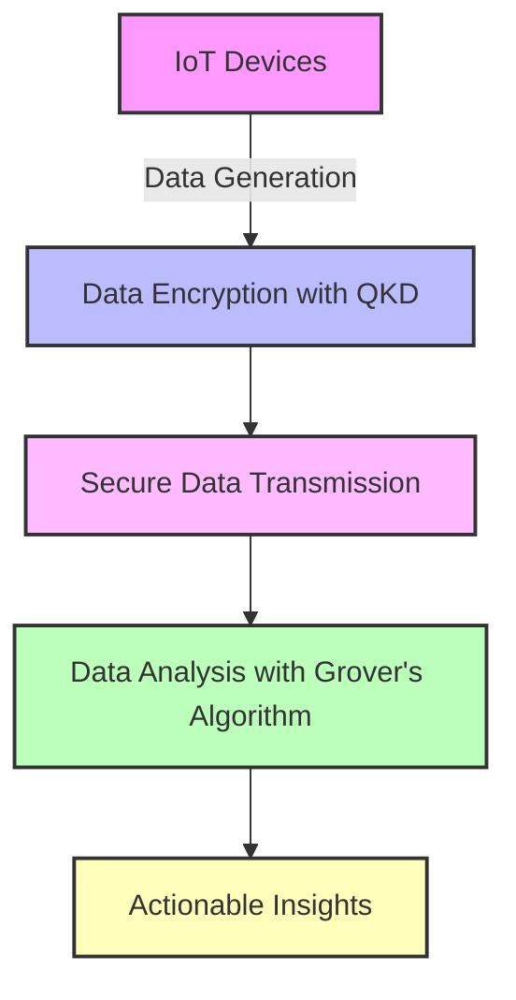
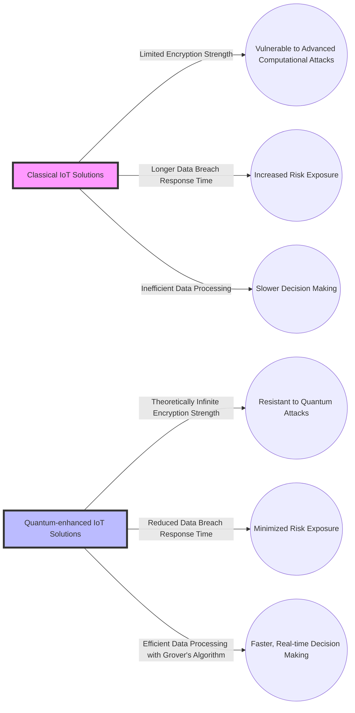
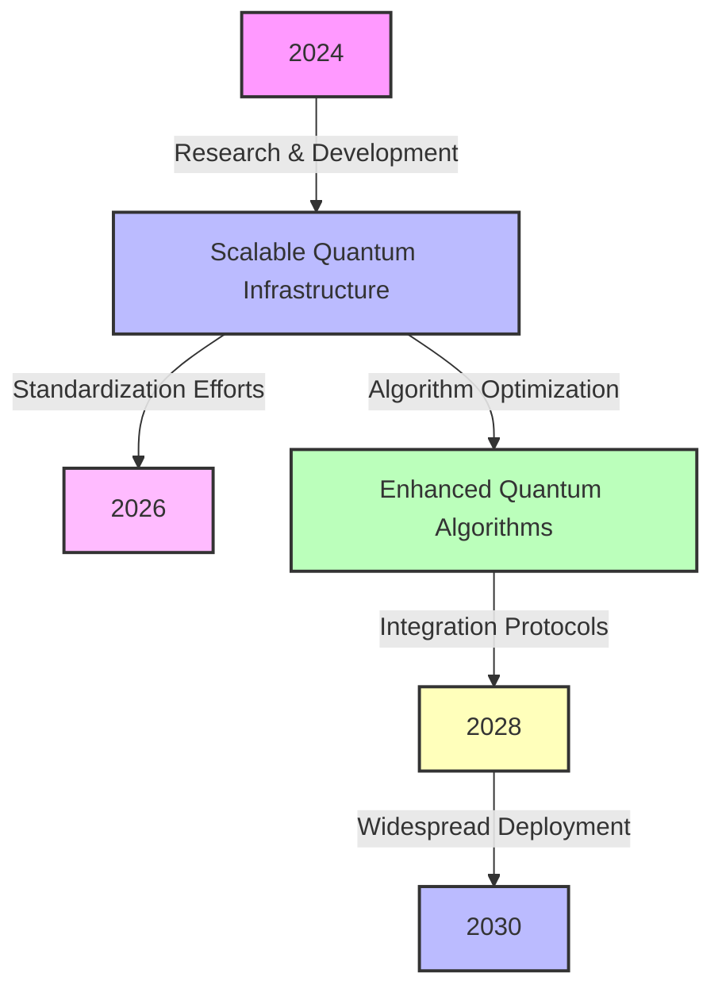

# Graph

```mermaid
lineChart
    title Probability of Detecting Eavesdropper vs. Quantum Bit Error Rate (QBER)
    xAxisTitle QBER (%)
    yAxisTitle Detection Probability (%)
    xType linear
    yType linear
    data
    series1: Intercept-Resend Attack
        0.5,99
        1,98
        1.5,95
        2,90
    series2: Photon Number Splitting Attack
        0.5,95
        1,90
        1.5,85
        2,80
    series3: Side-Channel Attack
        0.5,90
        1,85
        1.5,80
        2,75

```


| Encryption Method | Key Length (Equivalent) | Security Basis                  |
| ----------------- | ----------------------- | ------------------------------- |
| Classical         | 256 bits                | Computational Complexity        |
| QKD               | Theoretically Infinite  | Principles of Quantum Mechanics |


| Challenge                               | Description                                                  | Potential Solutions                                          |
| --------------------------------------- | ------------------------------------------------------------ | ------------------------------------------------------------ |
| Infrastructure Requirements             | The need for advanced infrastructure capable of supporting quantum technologies. | Development of cost-effective quantum devices and networks.  |
| Interoperability with Classical Systems | Ensuring seamless communication between quantum-enhanced and classical IoT devices and networks. | Creation of standardized protocols and interfaces.           |
| Scalability of Quantum Algorithms       | Adapting quantum algorithms like Grover's to practical, large-scale IoT applications. | Research into scalable quantum computing models and algorithms. |










