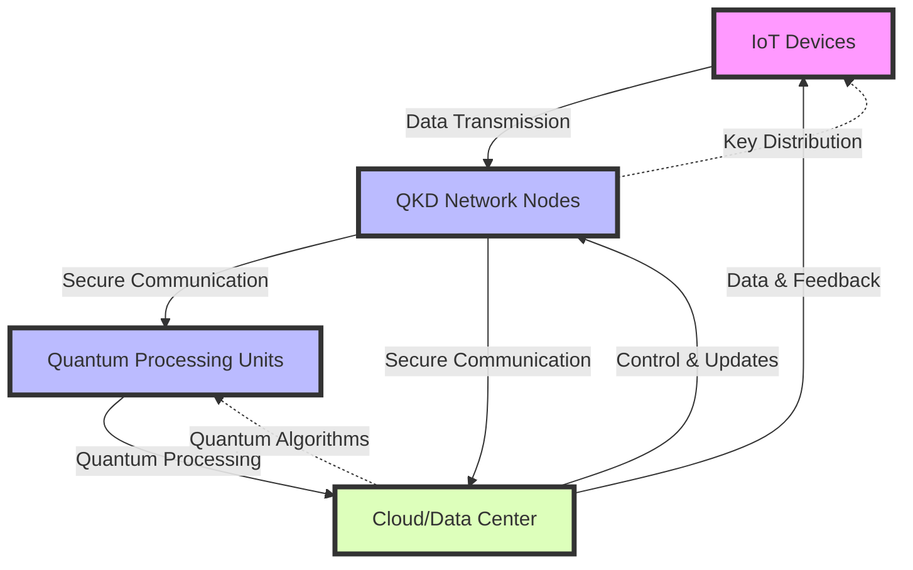
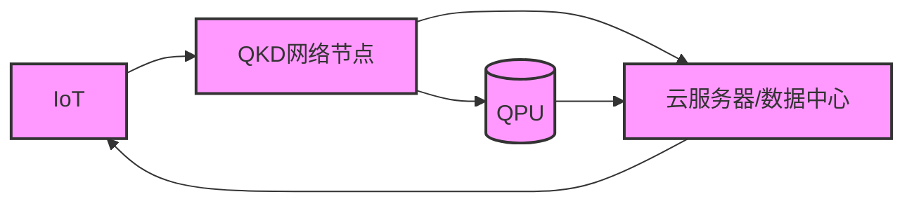
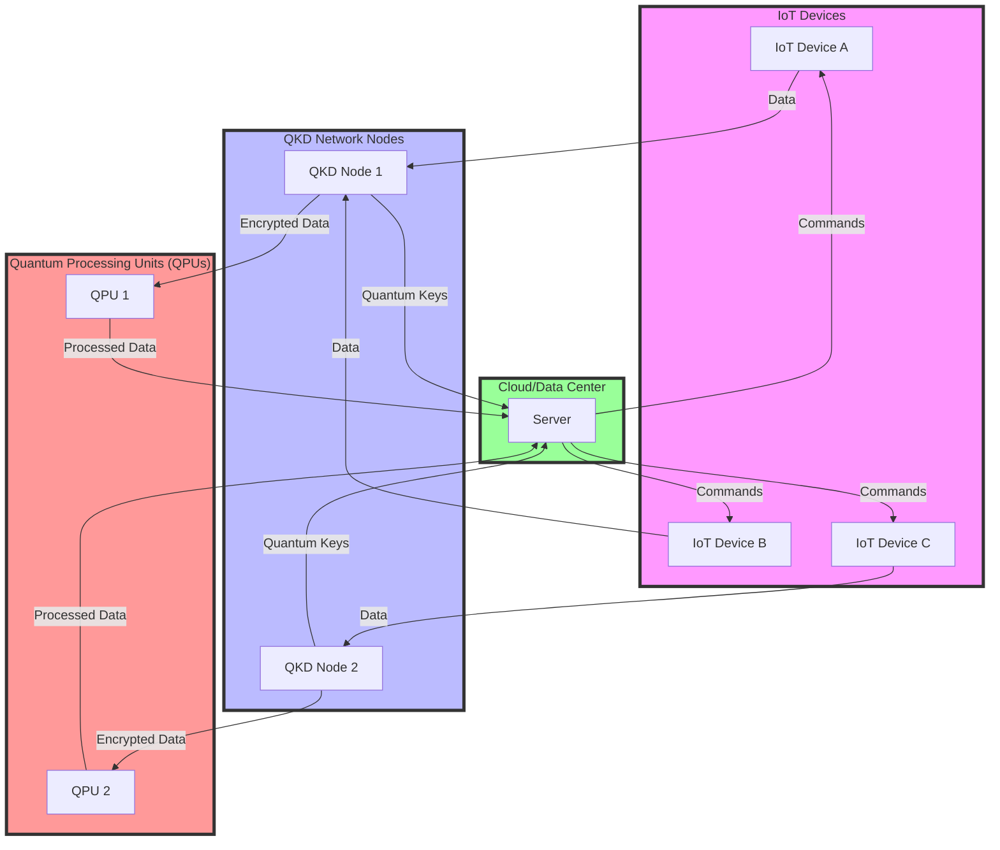
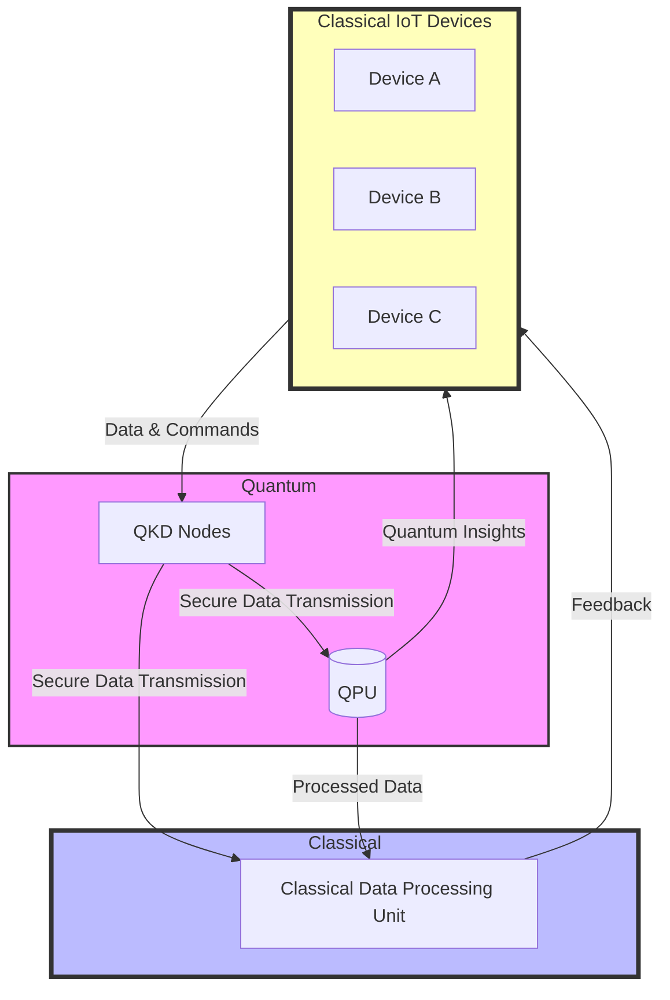
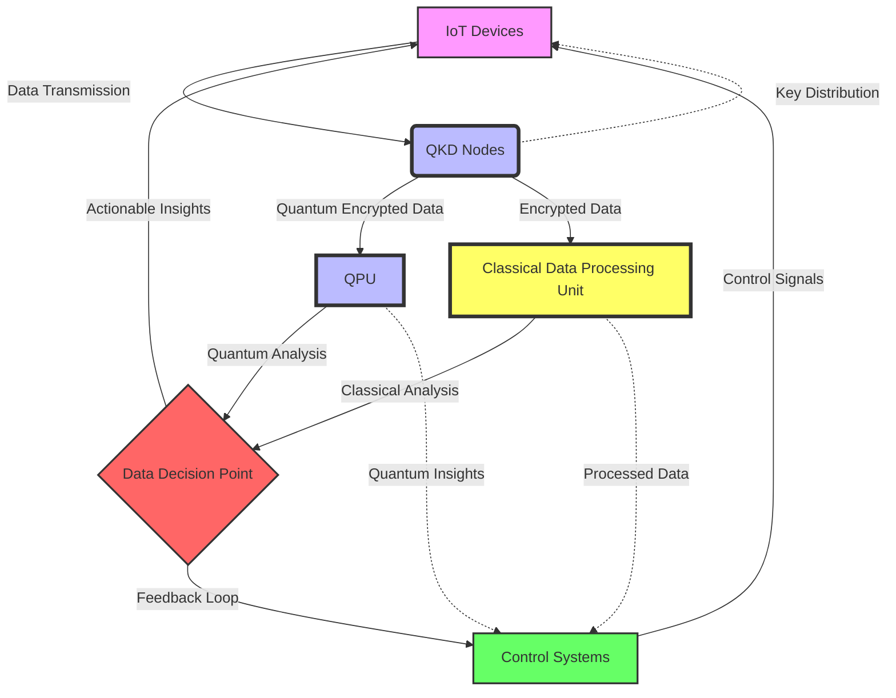
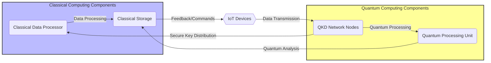
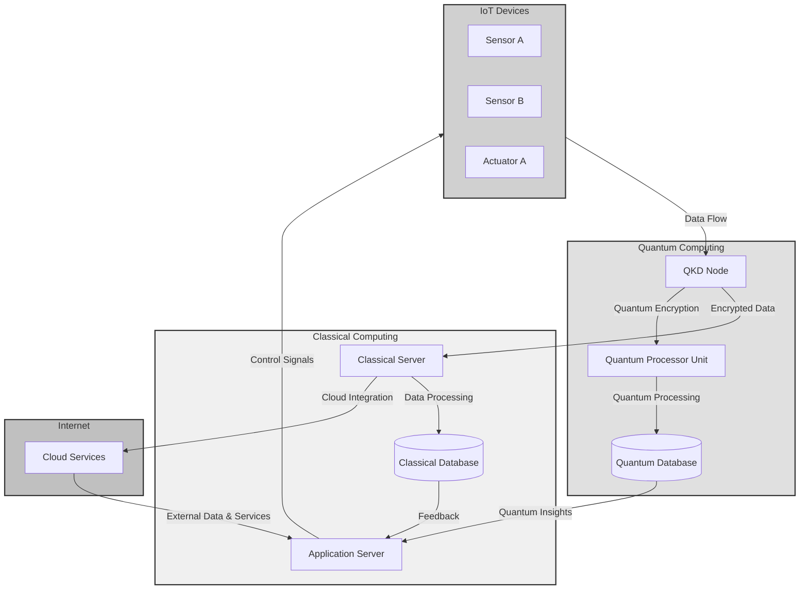

# Research Paper - 2st deliverable

This is your 2nd research paper deliverable. A minimum total of 3 pages is expected. Failure to submit the minimum will result in point deduction.

You should have:

1. Title, Abstract and Introduction (with the mandated a) list of contributions, paper structure and a strong motivation of the problem)
2. Following the introduction, you must have a section on current research in the area. a majority of your references (excluding your 1st delivery references) will be cited here. as you finish out each group of references, put down 1 or 2 sentences as to how they do not approach the problem like your contribution.

For example in the Black SDN for IoT paper, following the introduction, there was a Security overview of multiple IoT protocols that discussed a wide variety of threats and mitigations. All of those were focused on 1 point: header information was open, and packet header based attacks were not handled by any of the security mechanisms. over 50% of the references were in this section.

Intro+Abstract = 1 page; References = 1 page (minimum); exisiting research and discussion (with figures, tables, graphs) = 2 pages; 

presentation of your solution + discussion of your solution + unique approach = 2 pages (including figures, tables and graphs); 

Security analysis of your solution (tables + graphs) = 2.5 pages; 

Conclusions and Future research = 0.5 pages.

Reach out if you have questions. regards, shaibal

> 这是你提交的第二篇研究论文。预计至少有3页。未能提交最低分数将被扣分。 
>
> 你应该: 
>
> 1. 题目、摘要和引言(要求a)贡献清单、论文结构和问题的强烈动机) 
> 2. 在引言之后，你必须有一个关于该领域当前研究的部分。您的大部分参考资料(不包括您第一次交付的参考资料)将在这里引用。当你完成每组参考文献时，用1到2句话来说明他们如何不像你的贡献那样解决问题。 
>
> 例如，在Black SDN For IoT论文中，在介绍之后，有多个IoT协议的安全概述，讨论了各种各样的威胁和缓解措施。所有这些都集中在一点上: 报头信息是开放的，基于包报头的攻击不受任何安全机制的处理。超过50%的参考文献都在这一部分。 
>
> 简介 + 摘要 = 1页;参考文献=最少1页;现有研究和讨论(含数字、表格、图表)= 2页; 展示你的解决方案 + 讨论你的解决方案 + 独特的方法= 2页(包括数字，表格和图表); 解决方案的安全性分析(表格 + 图表) = 2.5页; 结论和未来研究 = 0.5页。 
>
> 如果你有问题，请联系我们。
>
> 问候, shaibal

| Feature                             | Quantum Key Distribution (QKD)                             | Classical Encryption Methods                                 |
| ----------------------------------- | ---------------------------------------------------------- | ------------------------------------------------------------ |
| Basis of Security                   | Principles of Quantum Mechanics                            | Computational Complexity                                     |
| Resistance to Computational Attacks | Resistant to all known computational attacks               | Potentially vulnerable to quantum computing                  |
| Key Exchange Security               | Theoretically secure based on changes in quantum states    | Based on the difficulty of mathematical problems, could be broken |
| Forward Secrecy                     | Naturally achieved by continually updating quantum keys    | Requires additional protocols or mechanisms                  |
| Key Renewal Process                 | Continuous generation and distribution enhance security    | Renewal and distribution can be complex and less secure      |
| Implementation Complexity           | Higher, requires specialized hardware and quantum channels | Relatively lower, relies on existing digital communication systems |

| Security Feature               | Role in Architecture                                         | Benefits                                                     |
| ------------------------------ | ------------------------------------------------------------ | ------------------------------------------------------------ |
| Quantum Key Distribution (QKD) | Provides secure communication channels by employing quantum mechanics principles to distribute encryption keys. | Practically immune to eavesdropping; ensures the confidentiality of data transmission. |
| Quantum-Resistant Algorithms   | Ensures the security of stored data and future-proofing against quantum computer attacks. | Protects against both current and future cryptographic challenges, safeguarding data against quantum attacks. |
| Privacy Enhancement Techniques | Applies additional layers of security to protect user data, such as differential privacy and homomorphic encryption. | Enhances user privacy by allowing data to be processed in encrypted form, minimizing data exposure. |

